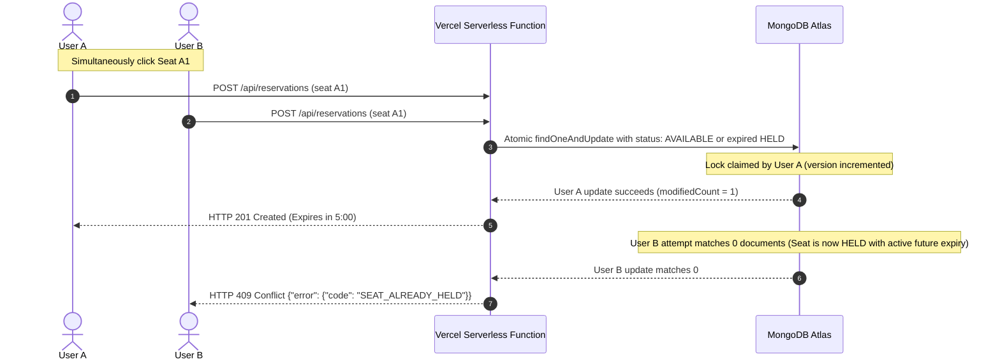

# EventLinqs — Serverless Event Ticket Booking Platform

[](https://ticket-booking-platform-cj998r7iz-suhirdha24s-projects.vercel.app)
[](https://nodejs.org/)
[](https://reactjs.org/)
[](https://www.mongodb.com/atlas)

> 🌐 **Live Production Website**: **[https://ticket-booking-platform-cj998r7iz-suhirdha24s-projects.vercel.app](https://ticket-booking-platform-cj998r7iz-suhirdha24s-projects.vercel.app)**

A production-grade, high-concurrency **Event Ticket Booking Platform** engineered specifically for **Vercel's Node.js Serverless / Fluid Functions** architecture backed by **MongoDB Atlas**.

---

## 🌟 Key Highlights & Engineering Features

- **⚡ Zero Always-Running Server Dependencies**: Built entirely for Vercel's serverless model (`api/index.js` wrapping Express `server/app.js`). No persistent `app.listen()` daemon required in production.
- **🍃 Serverless Cached Mongoose Pool**: Global connection cache manager in `server/config/db.js` prevents connection exhaustion across serverless function lifecycles and cold starts.
- **🔒 MongoDB-Authoritative Atomic Concurrency**: Strict atomic seat reservation locking with optimistic version checks. If two users simultaneously attempt to claim the exact same seat, **exactly one succeeds (`HTTP 201`)** and the losing request immediately receives **`HTTP 409 Conflict` (`SEAT_ALREADY_HELD`)**.
- **⏱️ Lazy 5-Minute Hold Expiry (No `setInterval`)**: Seat locks expire strictly after 5 minutes based on authoritative server timestamps (`heldExpiresAt <= Date.now()`). No background timer process required.
- **💳 Multi-Step Transactional Booking & Mock Payments**: ACID multi-document MongoDB transactions transition reservation -> `COMPLETED`, seats -> `BOOKED`, and create `Booking` snapshots with cryptographic QR verification tokens.
- **🎫 Verifiable Digital E-Ticket Passes**: Scannable HMAC-SHA256 signed QR codes rendered dynamically on canvas, instant `.ics` Apple/Google calendar export, and print/PDF ready layouts.
- **🛡️ Configurable 24-Hour Cancellation Cutoff**: Enforces organizer cancellation cutoff policies before triggering seat releases and payment refunds.
- **📊 MongoDB Aggregation Admin Analytics**: Multi-facet pipelines calculate gross revenue, ticket sales, category breakdowns, and recent order streams.
- **✨ Premium Glassmorphic Design System**: Rich dark-mode aesthetics, luminous gradients, micro-animations, skeleton loaders, and interactive stadium/theatre seat maps.

---

## 🏗️ Architecture

```
GitHub
  ↓
Vercel Deployment
  ├── React / Vite Frontend (SPA Routing)
  │     ├── /                      (Hero showcase & trending events)
  │     ├── /events                (Filter catalog by category, city, date, price)
  │     ├── /event/:id             (Event overview & pricing tiers)
  │     ├── /event/:id/seats       (Interactive visual seat map)
  │     ├── /checkout/:id          (5-min lock timer & mock payment form)
  │     ├── /success/:id           (Confirmed digital pass with QR code)
  │     ├── /my-bookings           (Upcoming/past tickets with 24h cancellation)
  │     └── /admin/*               (Analytics metrics & event management)
  │
  └── Express API (Serverless Handler in api/index.js)
        ├── /api/auth/*            (JWT registration, login, profile)
        ├── /api/events/*          (Event discovery & admin CRUD)
        ├── /api/venues/*          (Venues & layout configurations)
        ├── /api/events/:id/seats  (Dynamic seat effective status)
        ├── /api/reservations/*    (Atomic concurrency claiming)
        ├── /api/bookings/*        (Transactional booking & payment)
        ├── /api/admin/*           (Aggregation dashboard & oversight)
        └── /api/health            (Status check)
        ↓
   MongoDB Atlas (Replica Set)
```

---

## 📁 Folder Structure

```
├── api/
│   └── index.js                      # Vercel serverless function entrypoint
├── server/
│   ├── app.js                        # Express setup, CORS, Helmet, routes, centralized error handling
│   ├── server.js                     # Local development server ONLY (app.listen)
│   ├── config/
│   │   └── db.js                     # Serverless-cached Mongoose connection manager
│   ├── models/
│   │   ├── User.js                   # User model with bcrypt hashing & roles
│   │   ├── Venue.js                  # Venue model with section layout blueprints
│   │   ├── Event.js                  # Event model with pricing & cancellation policies
│   │   ├── Seat.js                   # Event-specific seats with index { event: 1, seatNumber: 1 }
│   │   ├── Reservation.js            # 5-minute temporary reservation lock schema
│   │   └── Booking.js                # Confirmed booking snapshot & QR token schema
│   ├── middleware/
│   │   ├── auth.js                   # JWT authenticate & requireAdmin middlewares
│   │   ├── validate.js               # Payload validation middlewares
│   │   └── errorHandler.js          # Centralized error handler with standardized error envelope
│   ├── routes/
│   │   ├── authRoutes.js             # /api/auth
│   │   ├── eventRoutes.js            # /api/events
│   │   ├── venueRoutes.js            # /api/venues
│   │   ├── seatRoutes.js             # /api/events/:eventId/seats
│   │   ├── reservationRoutes.js      # /api/reservations (atomic concurrency lock)
│   │   ├── bookingRoutes.js          # /api/bookings (transactional payment & booking)
│   │   └── adminRoutes.js            # /api/admin (aggregations)
│   ├── services/
│   │   ├── paymentService.js         # Mock payment service (CARD, UPI, NET_BANKING)
│   │   └── qrService.js              # Cryptographic QR token generator & verifier
│   ├── scripts/
│   │   └── seed.js                   # Database seeder (Admin, User, Venues, Events, Seats)
│   └── tests/
│       ├── setup.js                  # MongoMemoryServer test harness
│       ├── auth.test.js              # Auth & RBAC tests
│       ├── events.test.js            # Event search & filter tests
│       ├── seats.test.js             # Computed effective seat status tests
│       ├── reservation.test.js       # Atomic reservation & 5-min expiry tests
│       ├── concurrency.test.js       # CRITICAL: 2-user 1-seat concurrent collision test
│       ├── booking.test.js           # Transactional booking & payment failure tests
│       └── cancellation.test.js      # 24h cutoff cancellation tests
├── client/
│   ├── index.html                    # HTML entry point with Outfit & Inter typography
│   ├── vite.config.js                # Vite build config with proxy to /api
│   ├── src/
│   │   ├── main.jsx                  # React DOM mount point
│   │   ├── App.jsx                   # React Router registry & protected routes
│   │   ├── index.css                 # Glassmorphic custom CSS design system
│   │   ├── api/client.js             # Axios client using relative /api baseURL
│   │   ├── store/                    # Zustand state stores (auth, reservation, toast)
│   │   ├── components/               # UI components (SeatMap, TicketCard, OrderSummary, etc.)
│   │   └── pages/                    # Application pages (Home, Events, SeatSelection, etc.)
├── vercel.json                       # Vercel serverless routing, build command, SPA fallback
├── package.json                      # Root configuration with dev, test, and build scripts
└── README.md                         # Project documentation
```

---

## 🚀 Quickstart & Local Development

### 1. Prerequisites
- **Node.js**: v18.0.0 or higher (v20+ recommended)
- **MongoDB**: Local MongoDB instance or free [MongoDB Atlas](https://www.mongodb.com/atlas) cluster

### 2. Installation
```bash
# Clone the repository
git clone https://github.com/your-username/ticket-booking-platform.git
cd ticket-booking-platform

# Install root dependencies
npm install

# Install client dependencies
cd client && npm install && cd ..
```

### 3. Environment Configuration
Create a `.env` file in the project root:
```env
MONGODB_URI=mongodb://localhost:27017/ticket-booking-platform
# For MongoDB Atlas:
# MONGODB_URI=mongodb+srv://<username>:<password>@cluster0.mongodb.net/ticket-booking-platform?retryWrites=true&w=majority

JWT_SECRET=super_secret_jwt_key_for_development_2026
JWT_EXPIRES_IN=7d
QR_SECRET=super_secret_qr_hmac_key_2026
ADMIN_SECRET=eventhub_admin_secret_key_2026
PORT=5000
NODE_ENV=development
```

### 4. Database Seeding
Populate realistic venues, events, seat layouts, and demo accounts:
```bash
npm run seed
```

**Demo Accounts Created:**
| Role | Email | Password |
|---|---|---|
| **Admin** | `admin@example.com` | `Admin@123456` |
| **Standard User** | `user@example.com` | `User@123456` |
| **Test User 2** | `alex@example.com` | `User@123456` |

*(Note: 1-Click login buttons are available on the Login page for instant evaluator sign-in).*

### 5. Running the Local Dev Environment
```bash
# Runs both Express backend (Port 5000) and Vite frontend (Port 3000) concurrently
npm run dev
```

Visit:
- **Frontend App**: `http://localhost:3000`
- **Backend API Health**: `http://localhost:5000/api/health`

---

## 🧪 Automated Testing Suite

The project includes a comprehensive automated test suite powered by **Vitest**, **Supertest**, and **MongoMemoryServer**:

```bash
npm test
```

### Verified Test Suites (15 Core Scenarios):
1. **User Registration** (`POST /api/auth/register`)
2. **User Login** (`POST /api/auth/login`)
3. **Invalid Login Rejection** (Bad password / non-existent email)
4. **Admin RBAC Enforcement** (403 Forbidden for non-admins)
5. **Event Discovery & Filtering** (Search, category, date, price)
6. **Seat Dynamic Effective Status** (Lazy expiration of held seats)
7. **Successful 5-Minute Seat Reservation** (`POST /api/reservations`)
8. **Expired Reservation Rejection** (`HTTP 400 RESERVATION_EXPIRED`)
9. **Reservation Ownership Security** (User B cannot book User A's reservation)
10. **Confirmed Transactional Booking** (`POST /api/bookings` with snapshots & QR)
11. **Payment Failure Handling** (Rollback without confirming booking)
12. **Duplicate Booking Prevention** (Cannot re-book completed reservation)
13. **24-Hour Cutoff Cancellation Policy** (Enforces cancellation window)
14. **Seat Release on Cancellation** (Seats transition back to `AVAILABLE`)
15. **CRITICAL Concurrency Race Condition**: Two simultaneous users fighting for 1 seat -> **Exactly 1 succeeds (`201`), exactly 1 conflicts (`409 SEAT_ALREADY_HELD`)**, 0 double-bookings.

---

## 🔒 Concurrency & Seat Locking Strategy



### Error Response Envelope:
All API errors return a uniform, machine-readable JSON structure:
```json
{
  "success": false,
  "error": {
    "code": "SEAT_ALREADY_HELD",
    "message": "One or more selected seats are no longer available."
  }
}
```

---

## ☁️ Vercel Production Deployment Guide

### 1. Push to GitHub
```bash
git add .
git commit -m "feat: complete serverless event ticket booking platform"
git push origin main
```

### 2. Deploy on Vercel
1. Log in to [Vercel](https://vercel.com) and click **"Add New Project"**.
2. Import your GitHub repository.
3. In **Project Settings**:
   - **Framework Preset**: Vite
   - **Root Directory**: `./` (leave default)
   - **Build Command**: `cd client && npm install && npm run build`
   - **Output Directory**: `client/dist`
4. Add the following **Environment Variables** in the Vercel Dashboard:
   - `MONGODB_URI`: Your MongoDB Atlas cluster connection string
   - `JWT_SECRET`: A secure random 64-character secret
   - `QR_SECRET`: A secure random 64-character secret
   - `ADMIN_SECRET`: Secret for admin provisioning (optional)
   - `NODE_ENV`: `production`
5. Click **Deploy**.

### 3. Verification on Vercel:
- `https://your-app.vercel.app/` loads the React frontend.
- `https://your-app.vercel.app/api/health` returns `{"status":"ok"}`.
- `https://your-app.vercel.app/api/events` returns live events from MongoDB Atlas.
- Client-side routes (e.g. `/events`, `/my-bookings`) reload without 404s due to `vercel.json` SPA rewrites.

---

## 💳 Mock Payment Modes

| Method | Test Instructions |
|---|---|
| **CARD** | Enter any 16-digit card number (e.g. `4242 4242 4242 4242`). Check *"Test Mode"* to simulate card decline. |
| **UPI** | Enter standard VPA (e.g. `user@okhdfcbank`). Use `fail@upi` to simulate bank timeout. |
| **NET_BANKING** | Select any supported bank from the dropdown for instant mock clearance. |

---

## 📄 License
MIT License. Built with ❤️ by the Antigravity engineering team.
