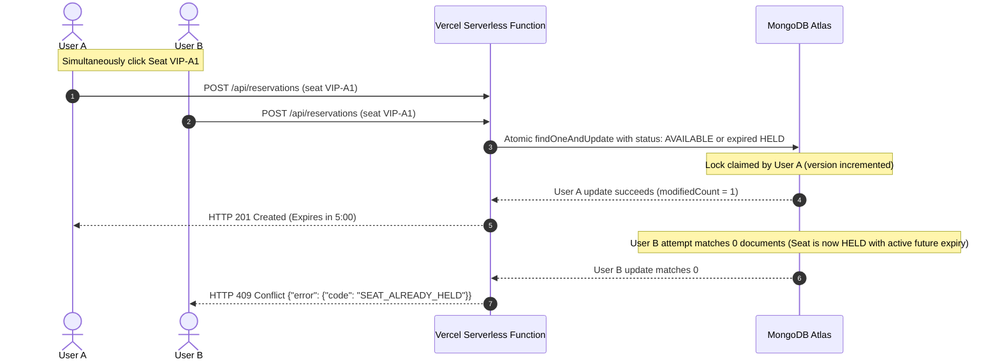

# 🎟️ EventLinqs — Serverless Event Ticket Booking Platform

[](https://ticket-booking-platform-rouge.vercel.app/)
[](https://nodejs.org/)
[](https://reactjs.org/)
[](https://www.mongodb.com/atlas)
[](https://opensource.org/licenses/MIT)

> 🌐 **Live Production Website**: **[https://ticket-booking-platform-rouge.vercel.app/](https://ticket-booking-platform-rouge.vercel.app/)**

A full-stack, production-grade, high-concurrency **Event Ticket Booking Platform** engineered specifically for **Vercel's Node.js Serverless Functions** architecture backed by **MongoDB Atlas Replica Sets**.

---

## 🌟 Key Highlights & Features

- **⚡ Serverless Architecture**: Powered by Vercel Serverless Functions (`api/index.js` wrapping Express 4 backend) with zero persistent server dependencies.
- **🍃 Connection-Pooled Mongoose**: Global cached connection manager in `server/config/db.js` prevents connection exhaustion across serverless cold starts.
- **🔒 Atomic Concurrency & 5-Minute Seat Locking**: Strict atomic seat reservation locking with optimistic version checks. If two attendees simultaneously attempt to claim the exact same seat, **exactly one succeeds (`HTTP 201`)** and the other immediately receives **`HTTP 409 Conflict` (`SEAT_ALREADY_HELD`)**.
- **⏱️ Lazy Expiration (No Cron / setInterval Required)**: Seat locks expire strictly after 5 minutes based on authoritative server timestamps (`heldExpiresAt <= Date.now()`).
- **💺 Interactive 160-Seat Stadium Map**: Visual seating grid with 50+ seats per tier:
  - 👑 **VIP Front Row**: **50 Seats** (Rows A to E × 10 seats)
  - ⭐ **Premium Central**: **50 Seats** (Rows A to E × 10 seats)
  - 🎟️ **General Upper Tier**: **60 Seats** (Rows A to E × 12 seats)
- **🏷️ Real-Time Tier Filter Pills**: Switch between All Sections, VIP, Premium, and General with real-time seat availability counts.
- **💳 Multi-Method Mock Payments**:
  - **UPI / Apps**: Google Pay, Paytm, PhonePe with smart 10-digit mobile number auto-formatting (e.g. `9876543290` → `9876543290@okhdfcbank`) and standard VPA support.
  - **Credit / Debit Cards**: Card simulation with test failure modes.
  - **Net Banking**: Instant bank checkout clearance.
- **🎫 Cryptographic Digital E-Ticket Passes**: Scannable HMAC-SHA256 signed QR codes rendered on canvas, instant `.ics` Apple/Google calendar export, and print/PDF ready ticket passes.
- **🛡️ 24-Hour Cancellation & Automated Refunds**: Enforces event cancellation cutoff windows before releasing seats back to `AVAILABLE` status.
- **🔐 Dedicated Authentication Portals**:
  - Attendee Sign-In: `/login` (and `/user/login`)
  - Administrator Sign-In: `/admin/login`
  - Anti-autofill security and duplicate user validation alerts with 1-click Sign-In redirection.
- **📊 Admin Analytics & Event Management**: Multi-facet MongoDB aggregation pipeline computing gross revenue, category distributions, occupancy rates, and recent transaction logs.
- **✨ Luxury Golden Glassmorphism**: Tailored dark-mode styling with amber gold accents, skeleton loaders, and micro-animations.

---

## 🏗️ Architecture & Request Flow

```
User Browser / Client
   ↓
Vercel Edge Network
   ├── React / Vite Single Page Application (client/dist)
   │     ├── /                      (Hero showcase & trending events)
   │     ├── /events                (Catalog filters by category, city, date, price)
   │     ├── /event/:id             (Event overview & pricing tiers)
   │     ├── /event/:id/seats       (Interactive visual seat map & tier filters)
   │     ├── /checkout/:id          (5-min reservation timer & mock payment form)
   │     ├── /success/:id           (Confirmed digital pass with QR verification)
   │     ├── /my-bookings           (Active & past tickets with cancellation)
   │     ├── /login                 (Attendee authentication)
   │     ├── /admin/login           (Dedicated administrator authentication)
   │     └── /admin/*               (Analytics metrics & event management)
   │
   └── Express API (Serverless Handler in api/index.js)
         ├── /api/auth/*            (JWT registration, login, profile)
         ├── /api/events/*          (Event discovery & admin CRUD)
         ├── /api/venues/*          (Venues & layout configurations)
         ├── /api/events/:id/seats  (Dynamic seat effective status & auto-generation)
         ├── /api/reservations/*    (Atomic concurrency locking)
         ├── /api/bookings/*        (Transactional booking & payment)
         ├── /api/admin/*           (Aggregation dashboard & oversight)
         └── /api/health            (Status check)
         ↓
   MongoDB Atlas (Replica Set)
```

---

## 📁 Repository Structure

```
├── api/
│   └── index.js                      # Vercel serverless function entrypoint
├── server/
│   ├── app.js                        # Express app, CORS, Helmet, routes, centralized error handling
│   ├── server.js                     # Local development server ONLY (app.listen)
│   ├── config/
│   │   └── db.js                     # Serverless-cached Mongoose connection pool
│   ├── models/
│   │   ├── User.js                   # User model with bcrypt hashing & roles
│   │   ├── Venue.js                  # Venue model with section layout blueprints
│   │   ├── Event.js                  # Event model with pricing & cancellation policies
│   │   ├── Seat.js                   # Event-specific seats with index { event: 1, seatNumber: 1 }
│   │   ├── Reservation.js            # 5-minute temporary reservation lock schema
│   │   └── Booking.js                # Confirmed booking snapshot & QR token schema
│   ├── middleware/
│   │   ├── auth.js                   # JWT authenticate & requireAdmin middlewares
│   │   ├── validate.js               # Payload validation middlewares
│   │   └── errorHandler.js          # Centralized error handler with standardized JSON envelopes
│   ├── routes/
│   │   ├── authRoutes.js             # /api/auth
│   │   ├── eventRoutes.js            # /api/events (seat generator helper)
│   │   ├── venueRoutes.js            # /api/venues
│   │   ├── seatRoutes.js             # /api/events/:eventId/seats (effective status)
│   │   ├── reservationRoutes.js      # /api/reservations (atomic concurrency lock)
│   │   ├── bookingRoutes.js          # /api/bookings (transactional payment & booking)
│   │   └── adminRoutes.js            # /api/admin (aggregations)
│   ├── services/
│   │   ├── paymentService.js         # Mock payment service (UPI, CARD, NET_BANKING)
│   │   └── qrService.js              # Cryptographic QR HMAC token generator & verifier
│   ├── scripts/
│   │   └── seed.js                   # Database seeder (Admin, Users, Venues, Events, Seats)
│   └── tests/
│       ├── setup.js                  # MongoMemoryServer test harness
│       ├── auth.test.js              # Auth & RBAC tests
│       ├── events.test.js            # Event search & filter tests
│       ├── seats.test.js             # Computed effective seat status tests
│       ├── reservation.test.js       # Atomic reservation & 5-min expiry tests
│       ├── concurrency.test.js       # CRITICAL: 2-user simultaneous collision test
│       ├── booking.test.js           # Transactional booking & payment failure tests
│       └── cancellation.test.js      # 24h cutoff cancellation tests
├── client/
│   ├── index.html                    # HTML entry point with Outfit & Inter typography
│   ├── vite.config.js                # Vite build config with proxy to /api
│   ├── src/
│   │   ├── main.jsx                  # React DOM mount point
│   │   ├── App.jsx                   # React Router registry & protected routes
│   │   ├── index.css                 # Amber Gold Luxury design system tokens
│   │   ├── api/client.js             # Axios client using relative /api baseURL
│   │   ├── store/                    # Zustand state stores (auth, reservation, toast)
│   │   ├── components/               # UI components (SeatMap, TicketCard, OrderSummary, etc.)
│   │   └── pages/                    # Routed pages (Home, Events, SeatSelection, etc.)
├── vercel.json                       # Vercel serverless routing, build command, SPA fallback
├── package.json                      # Root configuration with dev, test, and build scripts
└── README.md                         # Documentation
```

---

## 🚀 Quickstart & Local Development

### 1. Prerequisites
- **Node.js**: v20.x or v22+ (tested up to Node 24)
- **MongoDB**: Local MongoDB instance or [MongoDB Atlas](https://www.mongodb.com/atlas) cluster

### 2. Installation
```bash
# Clone the repository
git clone https://github.com/Suhirdha24/ticket-booking-platform-.git
cd ticket-booking-platform-

# Install root dependencies
npm install

# Install client dependencies
cd client && npm install && cd ..
```

### 3. Environment Configuration
Create a `.env` file in the project root:
```env
MONGODB_URI=mongodb+srv://<username>:<password>@<cluster>.mongodb.net/ticket-booking-platform?retryWrites=true&w=majority
JWT_SECRET=eventhub_jwt_super_secret_key_2026
JWT_EXPIRES_IN=7d
QR_SECRET=eventhub_qr_hmac_secret_2026
ADMIN_SECRET=eventhub_admin_secret_key_2026
PORT=5000
NODE_ENV=development
```

### 4. Database Seeding
Populate realistic venues, events across Indian cities, complete 160-seat stadium layouts, and demo accounts:
```bash
npm run seed
```

### 5. Running the Local Dev Environment
```bash
# Runs Express backend (Port 5000) and Vite frontend (Port 3000) concurrently with watch mode
npm run dev
```

Visit:
- **Frontend**: `http://localhost:3000`
- **Backend API Health**: `http://localhost:5000/api/health`

---

## 🧪 Automated Test Suite (15 Test Suites)

The project includes an automated test suite powered by **Vitest**, **Supertest**, and **MongoMemoryServer**:

```bash
npm test
```

### Core Verified Scenarios:
1. **User Registration** (`POST /api/auth/register`)
2. **User Login** (`POST /api/auth/login`)
3. **Invalid Login Rejection** (Bad password / non-existent email)
4. **Admin RBAC Enforcement** (403 Forbidden for non-admins)
5. **Event Discovery & Filtering** (Search, category, date, price)
6. **Seat Dynamic Effective Status** (Lazy expiration of held seats)
7. **Successful 5-Minute Seat Reservation** (`POST /api/reservations`)
8. **Expired Reservation Rejection** (`HTTP 400 RESERVATION_EXPIRED`)
9. **Reservation Ownership Security** (User B cannot book User A's reservation)
10. **Confirmed Transactional Booking** (`POST /api/bookings` with snapshots & QR)
11. **Payment Failure Handling** (Rollback without confirming booking)
12. **Duplicate Booking Prevention** (Cannot re-book completed reservation)
13. **24-Hour Cutoff Cancellation Policy** (Enforces cancellation window)
14. **Seat Release on Cancellation** (Seats transition back to `AVAILABLE`)
15. **CRITICAL Concurrency Race Condition**: Two simultaneous users fighting for 1 seat -> **Exactly 1 succeeds (`201`), exactly 1 conflicts (`409 SEAT_ALREADY_HELD`)**, 0 double-bookings.

---

## 🔒 Concurrency & Seat Locking Strategy



---

## ☁️ Vercel Production Deployment

### 1. Push to GitHub
```bash
git add .
git commit -m "chore: deploy to vercel"
git push -u origin main
```

### 2. Configure on Vercel
1. Import repository on [vercel.com/new](https://vercel.com/new).
2. Set Environment Variables:
   - `MONGODB_URI`: MongoDB Atlas connection string
   - `JWT_SECRET`: Secret key for JWT signing
   - `QR_SECRET`: HMAC key for QR codes
   - `NODE_ENV`: `production`
3. Click **Deploy**.

---

## 📄 License
MIT License. Built with ❤️ for EventLinqs.
